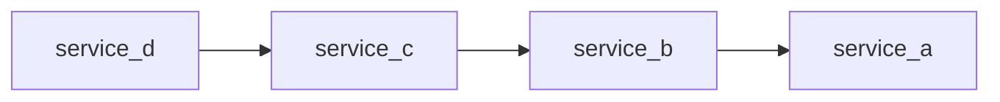

# Multiple service reproduction for turborepo

This reproduction is meant to illustrate that a change in a package used by one service can cause a rebuild in many other services. This repository is an extreme case where the dependency is completely linear.

## Introduction

This repository has 4 services, `a`, `b`, `c`, and `d`.
Each service has 3 packages, `api`, `infra`, and `sdk`.
The `infra` package for `a` has a string constant, which is used to introduce a change in the reproduction.
The `infra` package for `b`, `c`, and `d` contain a call to the previous API, using it's SDK.
The `api` package contains a NestJS API, that uses the `infra` package.
The `sdk` package contains an SDK generated based on an `openapi.json` file generated by the API.

When started, and the `d` API is called on `http://localhost:3003` it makes a call to service `c`.
Service `c` makes a call to `b`.
Service `b` makes a call to service `a`.
Service `a` returns the string in the `services/a/infra/src/index.ts` file.

## Setup
Requires java because openapi-generator requires it.
I used node 20.15.0 and Pnpm 9.9.0.
I also included a Makefile, because it's very nice.

## Reproduction

1. `pnpm i`
2. `turbo run build`
3. `turbo run build` --> full turbo
4. Change one character in the `services/a/infra/src/index.ts` file
5. `turbo run build` --> only 1/25 cached tasks (a polyfill package)
6. `turbo run build` --> full turbo
7. Change one character in the `services/a/infra/src/index.ts` file
8. `turbo run build generate_sdk generate_metadata generate_openapi --only` --> only 1/25 cached tasks (a polyfill package)
9. `turbo run build` --> full turbo
10. Try anything you like to make it work :)
